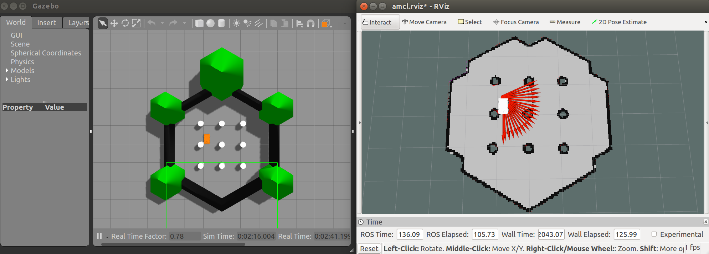

# 4-wheel-differential-car-ros

A four-wheel differential drive car in Gazebo with navigation, SLAM, and voice control

## Environment

Ubuntu 16.04

## Download

    git clone https://github.com/Wangbaiyue007/4-wheel-differential-car-ros.git

## Open robot in Gazebo and take control

One necessary process before everything:

    cd /carmodel_voice/libs/x64/
    sudo cp libmsc.so /usr/lib/
    cd ~/$(WORKSPACE)

This will make sure that the **catkin_make** works.

    catkin_make  
    roslaunch carmodel_description 02-drive.launch  
    roslaunch carmodel_teleop carmodel_teleop_key.launch

### I. SLAM

Close all.

    roslaunch carmodel_slam carmodel_slam.launch
    roslaunch carmodel_teleop carmodel_teleop_key.launch

Drive the robot around and draw a map.

    cd $(where you save your map)
    rosrun map_server map_saver -f $(YOUR_MAP_NAME)

The map with **YOUR_MAP_NAME** will be saved as a **.pgm** and a **.yaml** file.

### II. Navigation

#### 1. Fake navigation

Close all.

    roslaunch carmodel_nav fake_carmodel.launch
    roslaunch carmodel_nav fake_amcl.launch

Or you can choose the saved map:

    roslaunch carmodel_nav fake_amcl.launch map:=$(YOUR_MAP_NAME).yaml

#### 2. Gazebo navigation

Close all.

    roslaunch carmodel_description 02-drive.launch
    roslaunch carmodel_nav nav_mymap_demo.launch

Use the 2D nav arrow to navigate the robot in the *turtlebot map*.  

### III. Voice control

Close all.

Notice that if your computer is 32-bit, replace x64 with x86.

    roslaunch carmodel_description 02-drive.launch
    rosrun carmodel_voice iat_publish
    rosrun carmodel_voice voice_cmd

The valid command starts with "Robot", with the following operation: "forward", "back", "left", "right" or "stop", and do not contains "don't" or "not". For example, "Robot forward" will tell the robot to move forward.

## Reference

[mrobot](https://github.com/ROSClub/mrobot.git)  
[turtlebot](https://github.com/ROBOTIS-GIT/turtlebot3.git)  
[rbx1](https://github.com/pirobot/rbx1.git)
[讯飞语音听写](https://www.xfyun.cn/doc/)
